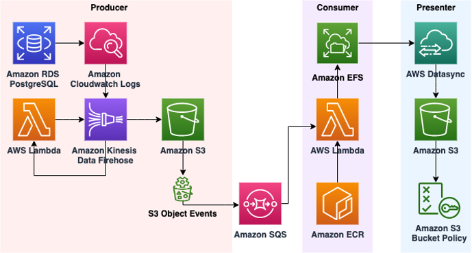

# A Serverless Architecture for analyzing PostgreSQL logs with pgBadger

PostgreSQL is one of the most popular open-source relational database systems. AWS offers services that make PostgreSQL database deployments easy to set up, manage, and scale in a cost-efficient manner. These services are Amazon Relational Database Service (Amazon RDS) for PostgreSQL and Amazon Aurora PostgreSQL-Compatible Edition.

Optimizing database performance is an important task for DevOps professionals. AWS provides tooling such as Amazon RDS Performance Insights and Amazon DevOps Guru for RDS to help with this task. The open-source community provides many options too, including the popular log analyzer pgBadger. pgBadger is an excellent tool for identifying both slow-running and frequently running queries and guiding you on how to improve their performance.


# Serverless pgBadger setup guide

## Overview

This GitHub repository contains:

1. A set of AWS CloudFormation samples to deploy an Serverless infrastructure for enabling pgBadger report
2. Code to build docker image for pgBadger

## Prerequisite

1. RDS PostgreSQL or Aurora PostgreSQL enabled with [Cloudwatch](https://aws.amazon.com/premiumsupport/knowledge-center/rds-aurora-mysql-logs-cloudwatch/) logs.
2. RDS PostgreSQL or Aurora PostgreSQL enabled with correct logging [parameters](https://aws.amazon.com/premiumsupport/knowledge-center/rds-postgresql-query-logging/)
3. Create [ECR](https://docs.aws.amazon.com/AmazonECR/latest/userguide/repository-create.html) repository.

   ```
    aws ecr create-repository --repository-name pgbadger-executor-py
   ```

4. Build and push docker image to ECR repository. this docker image will be used by Lambda function to process pgBadger logs.

    1. Update Makefile in /app/badger-executor/py/badger-executor-py/Makefile with your account ID
    2. Run Makefile

       ```
        make
       ```
5. Amazon EC2 key pairs and Windows instances
  ```
   aws ec2 create-key-pair --key-name MyKeyPair --output text > MyKeyPair.pem
  ```

# Architecture overview




## Setup Instructions:

1. (Optional) Run CloudFormation template [`/inf/cfn/db.yml`](inf/cfn/db.yml) to create Aurora Database in private VPC, following resources will be created.

	- VPC
	- Private/Public subnet and related resources
	- Aurora DB in private subnet

        NOTE: This step is not required if you are deploying solution for existing database in your VPC.

2. Run Cloudformation template [`/inf/cfn/vpc-3az.yml`](inf/cfn/vpc-3az.yml). This template will create brand new VPC and three private subnet to run Lambda and other resources. This cloudformation will also create Windows Server to access pgbadger report.
3. Run Cloudformation template [`/inf/cfn/pgbadger.yml`](inf/cfn/pgbadger.yml). Provide parent stack name from Step 2

## Viewing reports

Cloudformation output will give you link to URL for pgBadger Website, that will point to pgBadger report. report is setup up to run in auto-increment mode. DataSync is scheduled to run every hour, so report should update every hour. If you need to update report sooner then that, in that case you will have run [DataSync task](https://docs.aws.amazon.com/datasync/latest/userguide/run-your-task.html) manually.  Or you can duplicate the job in a different AZ.

   1. Open CloudFormation stack (`pgbadger.yml`), and check `Outputs` -> `PGbadgerWebsiteURL` to get PgBadger website URL.
   2. Open CloudFormation stack (`vpc-3az.yml`), and check `Outputs` -> `{StackName}-EC2PublicIp` to get Windows ec2 Public IP address.
   3. RDP to Windows VM, use the browser to access `PGbadgerWebsiteURL` url for pgbader reports.

## License

This library is licensed under the Apache 2.0 License.
